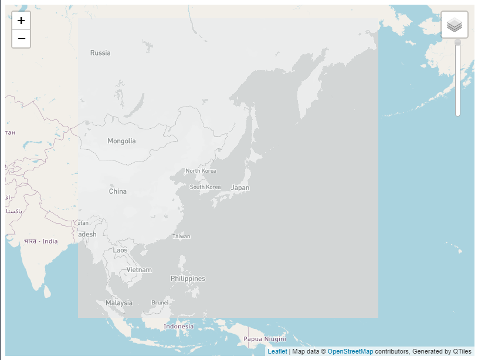

# Original MapBox Tiles

This monochrome map tile layers are created using MapBox Studio. The focus in on Japanese Islands with 5 different zoom levels. They are stored under `tiles` file, and this custom map style is publicly accessible with the following public API: <https://api.mapbox.com/styles/v1/jouh/ck9vyddfs04ty1ioiufrou5sc.html?fresh=true&title=copy&access_token=pk.eyJ1Ijoiam91aCIsImEiOiJjazZsZHZyMWIwZTZkM2pxZmpleXp5azNpIn0.VXENv-ez7pswPtnoTPtUZw>.

`QGIS` is used to convert this publicly accessed map style into tile layer files. There are 5 different zoom level available to this tile layers, and can be increased/decreased with preference. Note that during the creation of tilesets, the runtime will increase with increasing number of zoom levels.

Screenshot of the map generated:

Link to the web map: <https://jouho.github.io/original_mapbox_tiles/>
Link to the tutorial used to make this map: <https://github.com/jakobzhao/geog458/tree/master/labs/lab04>
